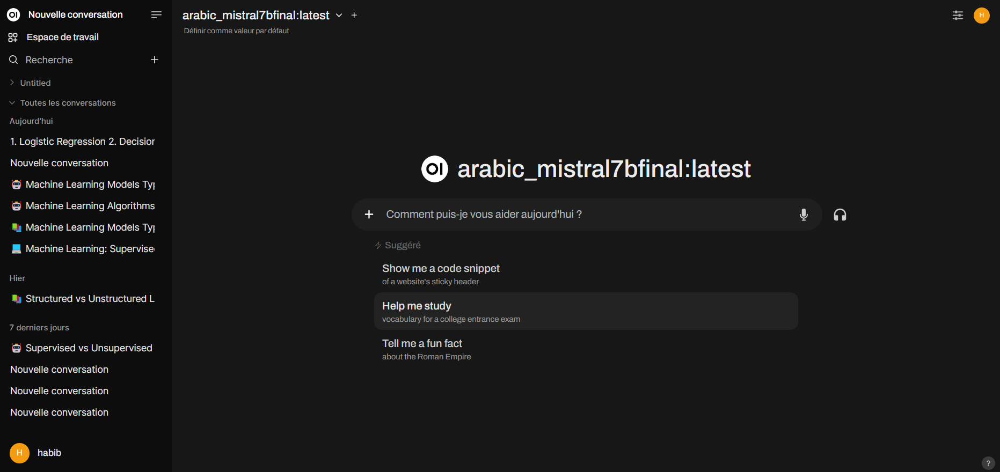

# 🌟 Chatbot en Arabe pour le Machine Learning 🌟

---

## 📋 Étapes Principales du Projet

### **1. Scraping des Données**
- **But :** Collecter des questions-réponses (Q/A) pertinentes pour le machine learning en anglais.
- **Sources utilisées :**
  - Turing Machine Learning Questions
  - MyGreatLearning Blog
- **Outils :** Utilisation de `Beautiful Soup` (Python) pour le scraping.

---

### **2. Nettoyage de la Base de Données**
- Suppression des caractères spéciaux, des espaces inutiles et standardisation du format des données.
- Validation manuelle pour garantir la pertinence des données collectées.

---

### **3. Traduction Anglais → Arabe**
- **Outils utilisés :** Trois modèles de traduction de Hugging Face :
  - [`Helsinki-NLP/opus-mt-en-ar`](https://huggingface.co/Helsinki-NLP/opus-mt-en-ar)
  - [`marefa-nlp/marefa-mt-en-ar`](https://huggingface.co/marefa-nlp/marefa-mt-en-ar)
  - [`t5-v1_1-base`](https://huggingface.co/t5-v1_1-base)
- **Résultat :** Le modèle [`marefa-nlp/marefa-mt-en-ar`](https://huggingface.co/marefa-nlp/marefa-mt-en-ar) a produit les meilleures traductions en termes de qualité et de pertinence.


---

### **4. Nettoyage et Formatage des Textes en Arabe**
- **Outils :** API Gemini (via prompts avancés) pour :
  - Reformuler et corriger les textes.
  - Générer des données dans le format SQuAD (Q/A structuré), adapté pour l'entraînement des modèles.
- **Approche :** Multi-shot pour garantir des exemples variés et cohérents.

  


---

### **5. Fine-tuning des Modèles LLM**
- **Modèles testés :**
  - **Finetuned Google AI Studio** (le meilleur parmi les trois modèles testés)
  - **AraBERT**
  - **T5-Small**
- **Résultat :** Bien que Finetuned Google AI Studio ait surpassé les autres modèles en termes de performances, aucun des trois modèles n'a produit des résultats satisfaisants pour la tâche spécifique.


---

### **6. Utilisation de Ollama et Fine-tuning**
- **Plateforme utilisée :** Ollama
- **Modèles testés :**
  - `Mistral 7B`
  - `Llama 3.2`
- **Étapes :**
  - Téléchargement et fine-tuning des modèles avec des fichiers adaptés (`modelfiles`).
- **Comparaison :** Le modèle **Mistral 7B** a démontré des performances supérieures en termes de scores WSSA et de retours qualitatifs.

  


---

### **7. Interface Utilisateur**
- Création d'une interface utilisateur avec **Ollama Open UI** pour interagir avec le chatbot.
- Investigation des modèles directement via l'interface pour valider leurs réponses et effectuer des comparaisons.

    


---
## 🛠️ Lancer les Modèles Mistral 7B et Llama 3.2 avec Ollama et Docker

### 1. Installation d'Ollama
Avant de commencer, installez Ollama sur votre machine en suivant ces étapes :

- Rendez-vous sur le site officiel d’Ollama : [https://ollama.ai](https://ollama.ai).
- Téléchargez la version d’Ollama correspondant à votre système d’exploitation (Windows, macOS ou Linux).
- Installez l’outil en suivant les instructions spécifiques à votre plateforme.

---

### 2. Télécharger les Modèles
Une fois Ollama installé, utilisez les commandes suivantes pour télécharger les modèles nécessaires :

#### Télécharger le modèle **Mistral 7B** :
```bash
ollama pull mistral7b 
```

#### Télécharger le modèle Llama 3.2 :
```bash
ollama pull llama3.2
```
---

### 3. Créer et Exécuter les Modèles
Pour fine-tuner ou personnaliser les modèles avec vos propres données, utilisez la commande suivante :
```bash
ollama create -f <path-to-modelfile> <nom-du-modele>
```

- Remplacez <path-to-modelfile> par le chemin vers le fichier contenant vos données ..
- Remplacez <nom-du-modele> par le nom que vous souhaitez attribuer au modèle.

#### Exemple :
```bash
ollama create -f ./data/mistral_Modelfile mistral7b-custom
```
---

### 4. Lancer les Modèles avec Docker et Open Web UI
Si vous souhaitez interagir avec les modèles via une interface graphique conviviale, utilisez Open Web UI avec Docker.

#### Étape 1 : Lancer le Conteneur Docker
Exécutez la commande suivante pour lancer le conteneur Docker :
```bash

docker run -d -p 3000:8080 --add-host=host.docker.internal:host-gateway \
-v open-webui:/app/backend/data --name open-webui --restart always \
ghcr.io/open-webui/open-webui:main
```

#### Étape 2 : Vérifier le Conteneur
Assurez-vous que Docker est installé et actif. Vérifiez l’état du conteneur avec cette commande :
```bash
docker ps
```
#### Étape 3 : Accéder à l’Interface
Ouvrez votre navigateur web et rendez-vous à l'adresse suivante :

http://localhost:3000

Vous pourrez alors interagir avec les modèles Mistral 7B et Llama 3.2 dans une interface utilisateur intuitive.


---


## 🚀 Résultats et Prochaines Étapes
- **Meilleur modèle :** `Mistral 7B`
- **Prochaines étapes :**
  - Améliorer la robustesse du chatbot sur d'autres dialectes arabes.
  - Ajouter des métriques avancées comme **BERTScore** pour évaluer les résultats.

---

## 📞 Contact
**Auteur : [Votre Nom]**  
📧 **Email :** [votre.email@example.com]  
🌐 **Portfolio :** [VotrePortfolio.com]  
📂 **GitHub :** [VotreGitHub](https://github.com/VotreGitHub)
